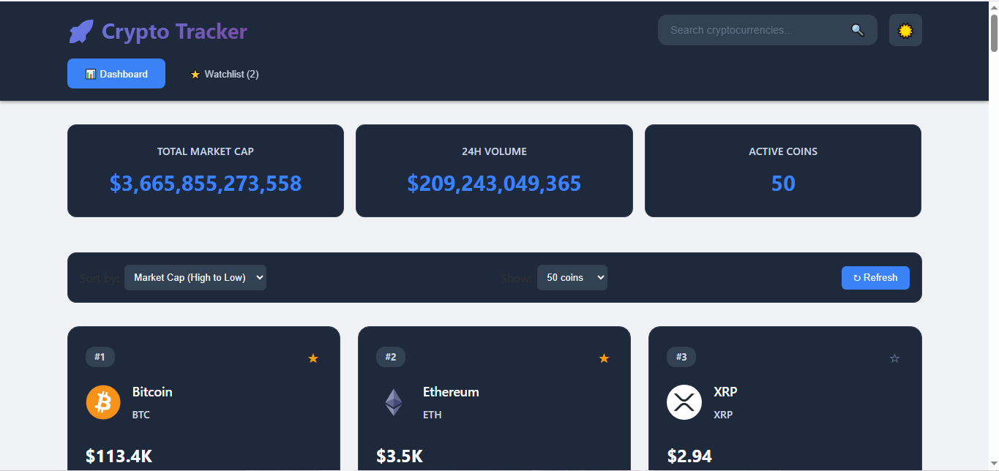

# 🚀 Crypto Tracker Dashboard

A beautiful, real-time cryptocurrency tracking dashboard built with React and Chart.js, featuring live data from CoinGecko API.



  

## 📋 Table of Contents
- [Features](#features)
- [Tech Stack](#tech-stack)
- [Installation](#installation)
- [Usage](#usage)
- [API Reference](#api-reference)
- [Project Structure](#project-structure)
- [Contributing](#contributing)
- [License](#license)

## ✨ Features

- **Real-time Data**: Live cryptocurrency prices and market data
- **Interactive Charts**: Beautiful price charts with Chart.js
- **Watchlist**: Add/remove cryptocurrencies to your personal watchlist
- **Responsive Design**: Works perfectly on desktop and mobile
- **Market Analytics**: Price changes, market cap, volume data
- **Search Functionality**: Quick search for any cryptocurrency
- **Dark/Light Theme**: Toggle between themes

## 🛠️ Tech Stack

- **Frontend**: React 18.2.0
- **Charts**: Chart.js 4.4.0
- **API**: CoinGecko API (Free tier)
- **Styling**: CSS Modules / Styled Components
- **State Management**: React Hooks (useState, useEffect)
- **HTTP Client**: Fetch API

## 🚀 Installation

### Prerequisites
- Node.js (v16 or higher)
- npm or yarn

### Quick Start
```bash
# Clone the repository
git clone https://github.com/yourusername/crypto-tracker.git

# Navigate to project directory
cd crypto-tracker

# Install dependencies
npm install

# Start development server
npm start
```

The app will open at `http://localhost:3000`

## 📖 Usage

### Basic Usage
1. **View Market Data**: Browse live cryptocurrency prices on the dashboard
2. **Add to Watchlist**: Click the star icon to add coins to your watchlist
3. **View Charts**: Click on any cryptocurrency to view detailed price charts
4. **Search**: Use the search bar to find specific cryptocurrencies
5. **Toggle Theme**: Switch between dark and light modes

### Environment Variables
Create a `.env` file in the root directory:
```env
REACT_APP_API_BASE_URL=https://api.coingecko.com/api/v3
REACT_APP_API_KEY=your_api_key_here
```

## 🔌 API Reference

- **API Key Required:** While CoinGecko offers public endpoints, the main ones used in this application require an API key for a higher rate limit (50 calls/minute). Please add your key to the .env file as shown in the Installation section.

### CoinGecko API Endpoints Used

```javascript
// Get market data for cryptocurrencies
GET /coins/markets?vs_currency=usd&order=market_cap_desc&per_page=100&page=1

// Get detailed coin information
GET /coins/{id}

// Get historical market data
GET /coins/{id}/market_chart?vs_currency=usd&days=7
```

### Rate Limits
- **Free Tier**: 50 calls/minute
- **Public API**: No authentication required for basic endpoints

## 📁 Project Structure

```
crypto-tracker/
├── public/
│   ├── index.html
│   ├── favicon.ico
│   └── manifest.json
├── src/
│   ├── components/
│   │   ├── Dashboard/
│   │   │   ├── Dashboard.js
│   │   │   └── Dashboard.module.css
│   │   ├── CoinCard/
│   │   │   ├── CoinCard.js
│   │   │   └── CoinCard.module.css
│   │   ├── Chart/
│   │   │   ├── PriceChart.js
│   │   │   └── PriceChart.module.css
│   │   ├── Watchlist/
│   │   │   ├── Watchlist.js
│   │   │   └── Watchlist.module.css
│   │   └── SearchBar/
│   │       ├── SearchBar.js
│   │       └── SearchBar.module.css
│   ├── hooks/
│   │   ├── useCryptoData.js
│   │   ├── useWatchlist.js
│   │   └── useLocalStorage.js
│   ├── services/
│   │   └── cryptoAPI.js
│   ├── utils/
│   │   ├── formatters.js
│   │   └── constants.js
│   ├── styles/
│   │   ├── global.css
│   │   └── themes.css
│   ├── App.js
│   ├── App.css
│   └── index.js
├── .env.example
├── .gitignore
├── package.json
├── README.md
└── LICENSE
```

## 🔧 Development

### Available Scripts
```bash
# Start development server
npm start

# Build for production
npm run build

# Run tests
npm test

# Lint code
npm run lint

# Format code
npm run format
```

### VS Code Setup
Install recommended extensions:
- ES7+ React/Redux/React-Native snippets
- Prettier - Code formatter
- ESLint
- Auto Rename Tag
- Bracket Pair Colorizer

### Code Snippets
Use these VS Code snippets for faster development:

**React Functional Component** (`rfc`)
```javascript
import React from 'react';
import styles from './ComponentName.module.css';

const ComponentName = () => {
  return (
    <div className={styles.container}>
      {/* Component content */}
    </div>
  );
};

export default ComponentName;
```

**Custom Hook** (`chook`)
```javascript
import { useState, useEffect } from 'react';

const useCustomHook = () => {
  const [state, setState] = useState(null);

  useEffect(() => {
    // Effect logic
  }, []);

  return { state, setState };
};

export default useCustomHook;
```

## 🤝 Contributing

We welcome contributions! Please see our [Contributing Guidelines](CONTRIBUTING.md) for details.

### Development Workflow
1. Fork the repository
2. Create a feature branch (`git checkout -b feature/amazing-feature`)
3. Commit your changes (`git commit -m 'Add amazing feature'`)
4. Push to the branch (`git push origin feature/amazing-feature`)
5. Open a Pull Request

### Code Style
- Use ESLint and Prettier for code formatting
- Follow React best practices
- Write meaningful commit messages
- Add comments for complex logic

## 📄 License

This project is licensed under the MIT License - see the [LICENSE](LICENSE) file for details.

## 🙏 Acknowledgments

- [CoinGecko](https://coingecko.com) for providing free cryptocurrency API
- [Chart.js](https://chartjs.org) for beautiful charting library
- [React](https://reactjs.org) team for the amazing framework

## 📞 Support

If you have any questions or need help, please:
- Open an issue on GitHub
- Check existing issues for solutions
- Contact the maintainers

---

**⭐ Don't forget to star this repository if you found it helpful!**